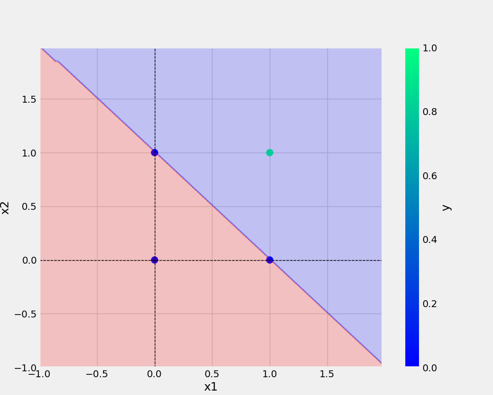

# Neuron
Neuron | Perceptron

# Commanad Used

```bash
git add . && git commit -m "First Commit" && git push origin main 

``` 

## Add Image



## Python Code

```python
ef main(data, eta, epochs, filename, plotfileName):
    
    df = pd.DataFrame(data)

    print(df)

    X,y = prepare_data(df)

    model = Perceptron(eta=eta, epochs=epochs)
    model.fit(X, y)

    _ = model.total_loss() # dummy Variable _

    save_model(model, filename = filename)
    save_plot(df, plotfileName, model)
    ```

## Dataset

x1 | x2| y
-|-|-

0|0|0
0|1|0
1|0|0
1|1|1

### 
*point 1
*point 2
